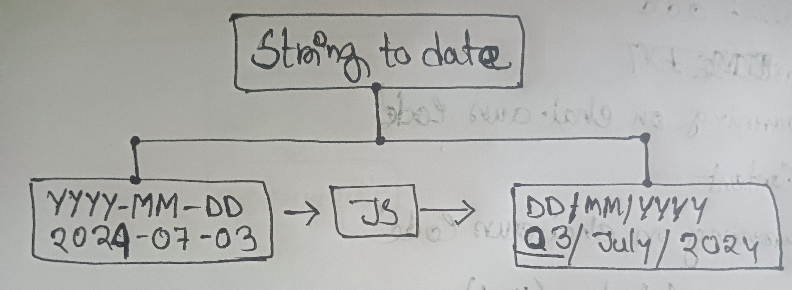
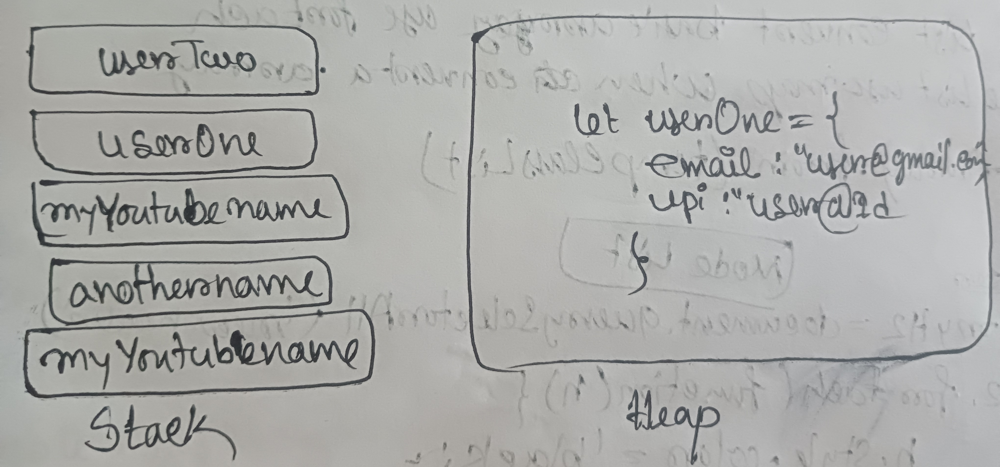
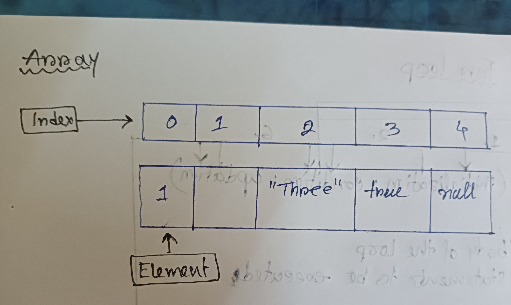
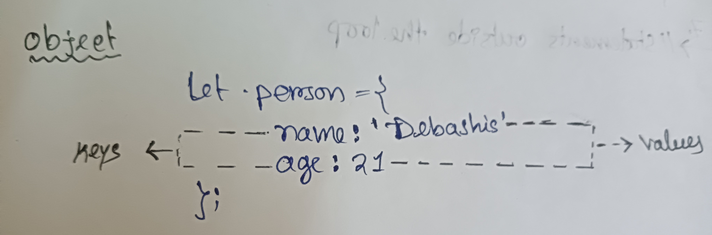

<div align="center">
  <h1> Personal Javascript Notes and source code</h1>

<sub>Author: Debashis Paul<br>
<sub>Educator: Hitesh Choudhary, founder of "chaicode.com"<br>
<small> Start Jun, 2024</small>
</sub>
</div>
<hr>

## Lecture 1, 2, 3: Set up new Repository in your Github Account stup and added VScode.

## Lecture 4: Variables & Constants

- Only people will survive in the Tech indutry whos motive is to create something product
- Through javascript, we can create, mobile app, web app etc
- Set goal to create Ecommerce app or social media app
- All game is about mindset, here mideset to create a sample product
- Think to create a ecomerce app
- I need to attract user and make him into register
- Given him/her unique id
- When user comes ➜ he enter the details like name, city, etc, it needs to store ➜ it ll stored in memory space, here it is varaible later DB ha
- Here, all the game is about, storing the data and retriving it
- So we learn variable and constants
- variable can be change but constant is constant
- We will learn about investigation
- We should the name that is easily readable
- When we see the var, let, const, it means, we need to assign in memory
- Const means, we cant change the value, it will through an error, if we try to change the constant value
- To write a comment, we use // 2 slashes, it means, javascript cant execute this lines
- We can print multiple values in console.log([]) like this by separting commas
- In js, let and const and be done using let and const
- In js, there was a problem of scope, means anything written in {}
- In js, when some programmer change the value in scope, it will impact the existing varaible
- So in modern js, we use let, const to overcome the issue of block scope and function scope
- /* */ this is also way of comment
- We can reserve the variable without using anykeyword as well, but it is not good practice
- In js, semicolon is optional
- Defualt value of let is undefined

  **File Link** :- [Variables](./01_basics/01_variables.js)
<hr/>
<br/>

## Lecture 5: Datatypes

- Prefer to practice on keyboard rather then taking notes on paper, write notes here itself so to remember
- **"use strict"** if we use above 2 words, it means it is newer version of javascript
- alert("hello") if we run the code, it ll given an error saying node is not defined, as js engine is hidden in browser ➜ it means, to run alert() has different way ti run it.
- In coding readability is very important ans it should be future proof
  For documentation prfer mdn (mozilla documentation)
- Original documenataion would be find in tc39.es
- ECMA Script is the standard way of writing javscript
- In js , we have different datatype,
- Primitive Datatype:
- Like number, string, boolean, null, undefined, bigInt, symbol
- Prefer to use double quotes for string datatype
- Boolean will say yes or no, it has only 2 values
- null ➜ it is standalone value, yes it is datatype as well
- null is representaiton of empty value
- null means value is empty, example, like giving empty value while monitoring the temp, as we cant give 0, as 0 has some value in temp scale
- ndefined ➜ means some value is not defined
- Symbol datatype is used to findout the uniquness ➜ it is used in react, to find the component
- typeof ➜ to know the type of any variable, we use typeof
- **Example:**
  ```javascript
  console.log(typeof "Debashis") ➜ string
  ```
   **File Link** :- [DataTypes](./01_basics/02_dataTypes.js)

<hr/>
<br/>


## Lecture 6: Conversion Operation



- We dont in javascript, what type of value we get, so we need to use conversion of datatype
- We can write typeof in 2 ways
  - typeof variablename
  - typeof(variableName)
- To convert string into Number, we use Number(variableName);
- When value is not proper number like 33abc, its type is NaN
- In Javascript, there is no strict check, so we use typescript
- Conversion of null into number is 0
- Conversion of undefined into number is NaN
- Conversion of boolean into number is false
- Conversion of string into number is NaN, as it is not able to convert into number
- **Number conversion summary:**
  ```javascript
  "33" => 33
  "33abc" => NaN
  true => 1; false =>0
- It is very important to know, is the value is converted and know what value it gives us back.
- Conversion of 1 gives true
- Conversion of "" emty string gives false;
- **Boolean conversion summary:**
  ```javascript
  1 => true, 0=> false
  "" => false
  "Debashis" => true

**File Link** :- [Conversion Operation](./01_basics/03_conversionOperation.js)
<hr/>
<br/>

## Lecture 7: Operations

- if string is 1st then all conversion will into string
- **Example:** ```javascript console.log("1"+2+2) ➜ 122```
- If the string is last then conversion will be done before that then string will be added
- **Example:**
  ```javascript
  console.log(1+2+"2") ➜ 32
- Should know about more about convertion: https://developer.mozilla.org/en-US/docs/Web/JavaScript/Reference/Operators/Increment


<hr/>
<br/>

## Lecture 8: Comparisons

- Comparison shouild be done with same datatype only
- Here console.log("2" >1) will be converted into 2>1 condition, here the auto conversion happens
- While comparion null is converted into 0 or NaN, example console.log(null > 0), means 0 > 0, hence answer is false. So avoid only value check but use value with datatype check.
- Comparison with undefined with 0 is always false, example: console.log(undefined == 0); it gives false
- In Javascript, comparison and equality check both work differently
- **==== Strict check:** it will check value as well as data type

  **File Link** :- [Comparision](./01_basics/04_comparision.js)
<hr/>
<br/>

## Lecture 9: Datatype summary

- Datatype is basically into 2 types
  - Primitive
  - Non-primitive
- Difference between is call by value and call by reference, it means how we are saving the data into memory and how we are accessing the data
- **Primitive Datatype:**
  - Primitive is into 7 categories
  - Prmitive datatype is call by value
  - when we take the data, it is copied, so the changes are done on copied data
  - String, Number, Boolean, null (meam empty), undefined, Symbol (to make the value unique), BigInt
- **Non-Primitive Datatype:**
  - It is also called as reference type
  - we can get the reference of the available data
  - Array, Objects, Functions

- **To master the javascript:** Learn Objects and browser events

- JavaScript is a dynamically typed language, which means that data types of variables are determined by the value they hold at runtime and can change throughout the program as we assign different values to them
- For big integer number, we add n at the end of the number.
- Object is declared with curly brases
- Datatype of function is called object function
- **Reference Documentation link:** https://262.ecma-international.org/5.1/#sec-11.4.3

  **File Link** :- [Data Types](./01_basics/datatypes-summary.js)
<hr/>
<br/>

## Lecture 10: Stack and Heap Memory



- Memory is of 2 types 1. Stack 2. Heap Memory
- Stack memory is used for primitiva datatype while heap memory is used for non primitive datatype
- we will get original value reference when take back the value from reference value
- Whatever goes in heap, we only get the reference, means whatever changes we are doing, we are doing in original value
- From stack, we get the copy of the value


<hr/>
<br/>

## Lecture 11: String in javascript

- Through string, we can use modern syntax to write it.
- We denote string single or double quote '' / ""
- In modern days, we need to use backticks `` for strin manipulation called string interpolation.
- All methods are available in **__proto__** for string, example toUpperCase() etc
- If we use methods related to **__proto__** then original value is not changed.
- we can check what character available we use charAt(index)
- **indexOf('charactor') :** we can get the index of the charactor
- **substring(0,4)** the last value is excluded.
- **trim() :** this method is used to remove the unwanted space, mostly it is used in filling the form
- **split('-') :** split mothod is used to split with specified digit and gives the output in arrays

  **File Link** :- [String](./01_basics/05_strings.js)
<hr/>
<br/>

## Lecture 12: Numbers and Maths

- If we write const score=400, then Javscript will recognise it as number, but we can explicitly define numbers as new Number(400)
- we can convert number into string using toString() method, it will help me to use string methods
- **toFixed() :**  to give the precision value till few decimal values, like toFixed(2) ➜ it wwill give .00 like that
- **toPrecision(3):**  it will focus on only 3 digit value only
- **toLocaleString('en-IN') :** this method will be helpful in giving the output in redable format of number, like 1000000 ➜ 1,000,00
- **Maths.abs():** it will convert -ve value into +ve value, +ve will remain +ve, it helps to convert valeue into +ve value.
- **Math.round():** To get the round value, example: Math.round(4.3) ➜ 4
- **Math.ceil():** It will round the value to top. Example: Math.ceil(4.6) ➜ 5 or Math.ceil(4.2) ➜ 5
- **Math.floor():** It will take bottom value, Example: Math.floor(4.2) -6-> 4.2 or Math.floor(4.6) ➜ 4, It will always takes the lowest value
- Mostly we will use round() method instead of ceil and floor
- **Math.min():** we can findout the minimum value from the given numbers, example: Math.min(3,4,5,6,) ➜ 3
- **Math.max():** we can findout the maximum value from the given numbers, example: Math.min(3,4,5,6,) ➜ 6
- **random():** it will the random value between 0 and 1
- To make the value in 1 digit then add 1, example: (Math.random()*10)+1
- We can round of the value using Math.floor in random method
- We can add 10, if we want the value more then 10

  **File Link** :- [Numbers & Maths](./01_basics/06_nums_and_math.js)
<hr/>
<br/>

## Lecture 13: Date and Time

- **Reference:** https://developer.mozilla.org/en-US/docs/Web/JavaScript/Reference/Global_Objects/Date
- Date is calculted in milli second starting from January 1st
- In future, we will be using Temporal object like Math, which will contain all the methods, but as of we will be using Date object only.
- Date can be converted into string using toString() method
- **toLocaleDateString():** It will give the value with date with / format Example: 9/27/2023
- **toLocaleString():** It will give the date value with time with / format Example: 9/27/2023, 7:05:46 PM
- In short: Every date method will add or remove some format
- Data type of Date is object
- Note: Month will start from 0 in javascript, but when we give the date in format it starts with 1, Example new Date("2023-01-23") ➜ 1/23/2023
- timestamp will be used, when we want to give the polls, like who has given the fastest answer
- **Date.now():** It will give the current date in milli second
- We can get the details about date using other method starting with get,
- **Example:**
  ```javascript
  let newDate = new Date();
  console.log(newDate.getMonth()+1) ➜ 9, added 1 as date always starts with 0.
- We can customise the date format, 

  **Example:**
  ```javascript
  newDate.toLocaleString('default',{ weekday: "short"}) ➜ Wed, as today is Wednesday

**File Link** :- [Date & Time](./01_basics/07_datesinJs.js)
<hr/>
<br/>

## Lecture 14: Array



- Array has squre brakcet, Array has elements in it.
- **Reference Documentation:** https://developer.mozilla.org/en-US/docs/Web/JavaScript/Reference/Global_Objects/Array
- We can store the muliple values in single variable
- Javascript array are resizable
- Array indexing starts with 0
- we can access the array using indexing, Example: myArr[0]
- When we copy array, the array creats shallow copy, means share same reference point, means, it will change the original array, while Deep copy do not share the same reference
- We can declare the array using 2 types
- Using square brakcet []
- Using **new Array()**. here it will add the square bracket by its own
- We can view all the methods available in array.
- **Example:**
  ```javascript
  const numbers = [1,2,3,4];
  console.log(numbers) ➜ click on prototype to see the methods
- Array contain the mixed data type
- Array ha prototype proerty access
- Array has length property , to calculate the length of an array
- **push():** It will add the value in the array
- **pop():** Remove the last available value in array
- **unshift():** Value will be added at the start, But here problem is, we need to shift all values to right
- **shift():** remove the first element from an array
- Some array method will answer in yes or no, like includes(), so based on true or false, we can write the condition and judge the value
- **join():** add all the element in the array but gives output into string
- **slice():** It will not update the orignal array, here last range is not included, will give the extracted array from start to end value
- **splice():** It will update the original array, Gives the extracted array as output.
- **concat():** It will combine 2 arrays and gives the new array
- **spread operator:** think glass of water, when glass fall ➜ water spread to the ground : remember
- In spread operator, we will get the spread out values
- **flat():** This method is used to flatten the array, we need to mention the depth as a pramater
- **Array.isArray():** To check the given array is array or not, it will give true or false response
- **Array.from():** this method will convert any given number/name into array
- If we pass an array in from, then we need to mention, do we need to create the array for keys or values
- **Array.of() :** Will give the newly formed array, will convert any values into new array

**File Link** :- [Array_1](./02_basics/01_arrays.js) & [Array_2](./02_basics/02_array.js) 
<hr/>
<br/>

## Lecture 15: Objects



- To master javascript, we need to learn 2 things
  - Objects
  - Events
- Objects can be declared in 2 ways
  - Literal
  - Constructor
- **Singleton:** It means, only 1 object is created.
- When the object is created using constructor, it is singleton
- **Example:** const JsUser = {}
- Object has keys and values
- By Default key is in the string format in object
- To access the object element, we use JsUser["name"] , it means we are accessing using string
- we can update the value of the user using = equal to
- We can freeze the object using Object.freeze() to avoid the further update
- To define Symbol, we use square bracket [], it says I am a symbol
- Function can be treated as a varaible in javascript
- We can get the reference if we dont give paranthesis in function call with object, example: JsUser.greeting ➜ [Function (anonymous)]
- If we want to reference the same object, then we can use 'this'

**File Link** :- [Object_1](./02_basics/03_objects.js)  
<hr/>
<br/>

## Lecture 16: Objects 2: Object using constructor

- We can create the object using {} or new Object(), here both are same
- We can have any level of nesting in object
- we can access the object key using [], for nested value we can use [][], Example : regularUser["fullname"]["userfullname"]["firstname"]
- We can use optional chainging to avoid the error: ?.
- **Object.assign():** This method copies all the values of an objects
- We can extract keys using Object.keys and values using Object.values from an object
- **Object.entries() :** To get all the values of object in key value pair
- **hasOwnProperty():** To check the property exists in object or not
- To check the different mehoda available in object, use this trick
- Go to browser console
- ```javascript
  const obj1 = {1:"a",2:"b"} ➜ obj1 ➜ chec all the methods in [prototype]

**File Link** :- [Object_2](./02_basics/04_objects.js)
<hr/>
<br/>

## Lecture 17: Objects Destrcuturing and JSON API

- Object destructuring is a syntactically sugar, means it only provide the syntax
- Object destructuring helps in avaoiding the repeatability of the code
- In Object destructuring, we are extracting the property from object
- We can rename the destructure value using colon :
- When we go to the restaurant and order something, the menu card is API Documentation
- When we order 'Samosa', we should not worry how it is made, just we have cOnsume it, Somosa is created at the backend, same goes with API.
- JSON is almost written like object, but key, value pair are stored in string
        ```json
        {
            "name": "hitesh",
            "coursename" : "js in hindi"
        }
        ```
- Use the url : https://api.github.com/users/hiteshchoudhary
- Use the API ➜ As the value is into JSON ➜ convert in javascript object ➜ use it, enjoy
- **Famous API:** Random user me: https://randomuser.me/ ➜ use https://randomuser.me/api/
- We can beautify the JSON using JSON Formatter online editor: https://jsonformatter.org/ ➜ we can beautify the JSON and check it into tree structure ➜ after this we can see how can we deal with it, may be using array or object

<hr/>
<br/>

## Lecture 18: Functions and parameters


- While learning about functions, it is important to know about memory management as well.
- Function means, what the 10, 20 etc lines of code you have writte, we kept in package
- We can resue the package, as much as we want
- To write a function, we give function keywoes, function name, then pranthesis then scope of function, this is called function defination
- To call the function, we function name with parenthesis, then function will execute it.
- In javascript, it automatically check the datatype of value, so it is important to check the type of any variable before doing any operations
- **function parameter :** while creating the function defination, whatever the inputs we take, we call it as parameters
- **function arguments:** The values which we pass in the function call, we call it as an argument
- It is important to know, what we are sending form the function
- **Note:** Whatever you write after function return, nothing will work
- undefined and "" empty string is considered as false value
- So to check the error, check with false value ➜ Example:  if(!username)
- We can give default value in function parameter with equals to, Example loginUserMessage(username = "sam")  ➜ it will avoid to go into error check, if no username available
- **Rest Operator:** ... when these 3 dots comes in parameter, it means get all the values and give me in bundle.
- **Example:** Get all the values in cart value<br>
**File Link** :- [Function](./03_basics/01_functions.js)
<hr/>
<br/>

## Lecture 19: Global and local scope

- Scopes story starts with var, let and const
- **{} :**  This is called as scope
- When {} comes with function or if, then we called its scope
- When any thing declared inside {} it is called block scope, and outside of {} is called global scope
- value declare in global scope ➜ it is available in block scope but value declaredin block scope is not available in global scope.
- var is functional scope, where as const, let are block scope.
- Global scope is different for node environment and browser<br>

**File Link** :- [Function](./03_basics/)
<hr/>
<br/>

## Lecture 20: Scope level and mini hoisting

- {} Is only scope in javascript ha
- Kids can ask ice cream from elder but it is awekword if elder ask the ice cream from kids
- It means, inner function can access the variable from outside but outside function cant ask inner member variables etc
- Variable declared inside the insode function cant be access outside function
- Every time function is called, then every time it is kept in stack
- Closure in simple line, the inner function can access the outside declared variable
- There are 2 technique to create a function, using bassic function, other is function expression
- Hositing is not possible with function expression, but hoisting is possible with basic function only<br>
**File Link** :- [Scope](./03_basics/02_scopes.js)
<hr/>
<br/>

## Lecture 21: this and arrow function

- ES6 came in 2015 and came with lots of new features
- Arrow function and this keyword are the features of ES6
- this keyword tells about current context
- When we refer to the current context of the object, we use this keyword
- In node environment, current object refer to empty object
- Node javascript engine is stand alone, earlier javascript engine is in a browser
- In brower there is a global object called window object
- this keyword is not accessible in noraml function and function expression (doubt)
- To write arrow function, replace function keyword with qual and arrow in function expression
- **Note:** this keyword can be accessible in normal function, act as a global object but not in arrow function
- **syntax of arrow function:** const sampleArrowFunction = ()=> {}
- **Implicit Return:** when arrow function is 1 liner, then we consider it as implicit return and no need to write the return keyword
- if use curly braces, ➜ then need to use return. If we use paranthesis, then no need to add the return keyword.
- To return the object, we should wrap in parenthesis<br>

**File Link** :- [arrow](./03_basics/03_arrow.js)
<hr/>
<br/>

## Lecture 22: Immedietly Invoked function

- The function which has its own scope and executed immideitly
- **IIFE:** Function defination is wrapped in paranthesis and use empty parenthesis for execution: ()()
- Note: To avoid the use of global variable, as global variable pollute the variable, so we use IIFE
- Note: To stop the IIFE, It is important to add the semicolon after IIFE
- We can write IIFE using normal function as well as arrow function
- Remember 2 IIFE can be written by seperating semicolon
<br>

**File Link** :- [IIF](./03_basics/04_iife.js)
<hr/>
<br/>

## Lecture 23: Javascript Behind scene

- Remember how the call stack works in javascript
- Javascript Execution context:  it means, the javascript created by you, how it will run
- Javascript has 2 execution context:
        1.  Global execution context: It is store in 'this', executed in thread, remember javascript is single threaded language
        2.  Functional execution context
- Javascript runs the code into 2 phases
        1.  Memory creation phase:
- Memory is created for variables and functions declared, it is not executed here
- Just variables are created, and kept with us
        2.  Execution Phase:  we will get all the values
- lets see with the example:

    ```javascript
                  let val1 = 10;
                  let val2 = 5;
                  function addNum(num1, num2){
                      let total  = num1  + num2;
                      return total;
                  }
                  let result1 = addNum(val1, val2)
                  let result2 = addNum(10, 2)
                  ```
              1.  Memory Creation Phase: Here, In 1st cyle we will get
                - val1 -> undefined
                - val2 -> undefined
                - addNum -> defination
                - result1 -> undefined
                - result2 -> undefined
              2.  Execution Phase:
                - val1  <- 10
                - val1  <- 5
    
- For addNum function, now different execution phase will be created
  - 1. New variable environment
  - 2. Execution thread
    - Memory phase:
      - val1 -> undefined
           - val2 -> undefined
            - total -> undefined
        - Execution context: Here execution happens
            - num1 -> 10
            - num2 -> 5
            - total -> 15 ➜ total will return to global execution context
        - The execution context will be deleted after the work is done
        - result1 -> 15
        - result2 -> here again 2 phased will be created
          1. Memory phase
          2. Execution Phase
            - here again the total will be calculated and sent to the execution context
- **Callstack:** All the method will be executed here, it will be removed once the work is done
- It follow the LIFO
- We can check the flow of function call by giving break points

<hr/>
<br/>

## Lecture 24: Control flow 

- In if statement, if the condition is true then only code will execude for if statement
- If statment will be having comparison statement
- Following are the comparator operators checking:
- Less then < ➜ Example: 10 < 20 ➜ check 10 is less then 20, yes it is, so output: true
- Greated then >
- Less then and equal to <=
- greater then and equal to >=
- Equal to ==, note single operator is assignmnet operator, Example: const isLoggedIn = true, means true is assigned to isLoggedIn, but here == is comparison operator
- Not Eqaul != ➜ 3 !=2 ➜ -ve checking ➜ 3 is not equal to 2 ➜ output: true
- === will check the type and value, it is strict equality check
- !== It will do -ve type and value checking
- else is conditional code, it will executed either if statement or else statement
- Scope is counted in curly braces {}
- var scope is compltely global, it means, it accessable outside {} as well
- **&& :** and condition will check both left and right condition
- **Example:** Do you need to buy phone and cover ➜ yes
- If any of the condition is wrong in &&, the block will not get executed
- **|| :** called pipe sign, help to multiple check or condition
<br>

**File Link** :- [Basics](./04_control_flow/one.js)

  #### Switch case:
  
  - Using switch case, we will be checking multiple values
  **syntax:**
    ```javascript
    switch(key){
        case value:
            break;
        default:
            break;
    }
    ```
  - Here key is the condition, we need to check everytime
  - Use intellesence or seuggestion in vscode for switch case
  - If nothing match, then default case will be excuted
  - whenever, key is match rest all code will be executed, so we give break to avoid limited details to show
  <br>

  **File Link** :- [Switch Case](./04_control_flow/switch.js)

  #### Truthy & flasy values
  
  - Any value added in string is truthy value
  - [] empty arry, empty object are truthy value
  - If only function is declared, then that is also truthy value
  - Object.key() will return the array
  - **Remember:** it is true comparison below
    - false == 0 ➜ true
    - false == '' ➜ true
    - 0 == '' ➜ true
    - && || are called logical operator<br>

    **File Link** :- [Truthy & flasy values](./04_control_flow/truthy.js)

  #### Nullish Coalescing Operator (??)
  
  - Need to focus on Null and undefined values
  - ?? it will check the safty value, based on null or undefined it will assign some other value
  - While using ?? operator twice, it will take the 1st assigned value, Example: null ?? 10 ?? 10 ➜ output: 10
  - ?? is basically used to handle errors
  - nullish and null operator are 2 different thing
  - Ternary operator: it is short cut of writing if else statement
  - Syntax: condition ? true : false

<hr/>
<br/>

## Lecture 25: for loop, break and continue


- use ctrl + d : to select the multiple value at once
- To stop any control, we use break keyword
- continue is like, sorry for 1 time (means skip when the condition match) and continue the process remain
<br>

**File Link** :- [For Loop](./05_iteration/one.js)
<hr/>
<br/>

## Lecture 26: while, do while loop

- There are many loops, there are different ways to solve the problem.
- Logically, we need to do the same, what we did in for loop, like initialisation, checking condition, increment or decrement
  ```javascript
    // While syntax
    while(condition){
        // if above condition is match, then execute the statment
    }
  ```
- Readability of the code is very important
  ```javascript
      //do while syntax
      do{
          //statement
          //increment / decrement
      }while(condition)
  ```
- In do-while, work is done first then later condition is checked
- Mostly we dont use d0-while loop, as we check the condition first
- It is very very common to loop the array, as the API Value, DB values comes in the form of array

<hr/>
<br/>

## Lecture 27: Higher order array loops

- There are other loops in array like for-in, for-of, forEach, its our choice what to use.
- There is very common scenario, where we can have
- strings in array ["","",""]
- Objects in array [{},{},{}]
- So we need to iterate it, so use higher order array loops
- string, array, objects are iterators, so we can use loops on it.
- **Syntax of for...of loop:**
  
  ```javascript
        for(const iterator of object){

        }
  ```
- Above object is used as a broader term, it means, on what you want to use loop, dont confused with javascript object
- In for...of loop, there is no need to worry about initialisation, increment or decrement.
- Instead of giving names like i,j, it is better to use meaningful name, like greetings, greet, numbers, num etc
- Map is use to store key, value pair
- **Reference:** https://developer.mozilla.org/en-US/docs/Web/JavaScript/Reference/Global_Objects/Map
- Map is like object with slight difference
- Map is used to store unique values, persist the same order how it entered
- We can iterate the Map using for...of loop by destructuring the value
```javascript
  for(const [key, value] of countries){
      console.log(`Key: ${key} Value: ${value}`)
  }
```
- Note: Not possible to iterate the object using for..of 


#### Object iteration:

  #### for...in loops
  - **for...in loop syntax:**
    ```javascript
          for(const key in myObject){
  
    ```
  - To retrive value from object, we use objectName[key]
  - Maps are not iterable so we cant use for..in loop for Map

  #### forEach loop
  - For most of the time, we may use forEach loop for array
  - Array has some inbuilt methods, here forEach method, so we can use it to access the elements of an array
  - Passing callback means give me the function to operate
  - callback function doesn't have name
  - While iterating an array, every time the function will get executed, and take as a pramater to it.
  - forEach doesnt only return item, but it will return item, index and whole array
  - callback has access to all the element of an array<br>
  **File Link** :- [Higher order array](./05_iteration/two.js)
<hr/>
<br/>

## Lecture 28: filter, map and reduce

  #### filter():
  - forEach dont return any value, either you wanted or not
  - filter return some values
  - filter is having callback function which has access to each element, then we have to give the condition. If the condition is satisfies then return those values else dont return the values
- When we write paranthesis, then no need to write the return keyword.
  
  ```javascript
  const myNums = [1,2,3];
  const newNums = myNums.filter(num => num > 4)
  ```
- When we use curly braces, then we need to use return, as we will start the scope here.
  ```javascript
    const myNums = [1,2,3];
    const newNums = myNums.filter(num=> {
        return num > 4;
    })
  ```
- Consider an array has given with some objects, so we need to apply filters on it.

  #### map():
  - It looks better than forEach loop
  - It also have a callback
  - map automatically return the new array
  - Chaining methods: means we can apply multiple methods at once
  - Whatever values are passed in chaining it will be passed to respective methods

  #### reduce():
  - Reference: https://developer.mozilla.org/en-US/docs/Web/JavaScript/Reference/Global_Objects/Array/reduce
  - Whatever we give the initial value, it goes into accumulator
  - Reduce will work on entire array
  - In reduce methods, we get 2 parameter, one is accumulator and other is current value
  - We can assign the value from which we want to start the value in accumulator<br>
  **File Link** :- [Filter, Map, Reduce](./05_iteration/three.js)
